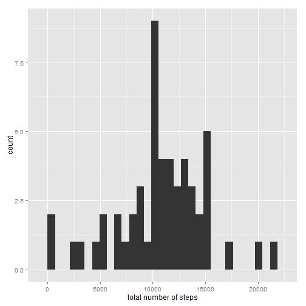
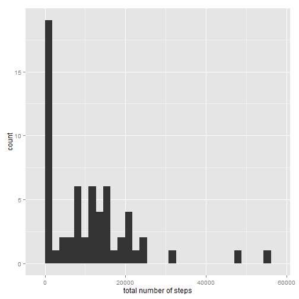
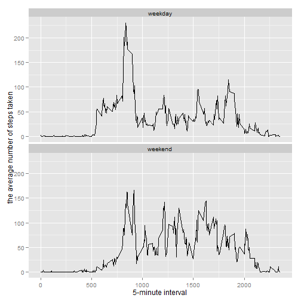

##Loading and preprocessing the data:


```r
act<-read.csv("activity.csv")
```

##What is mean total number of steps taken per day?:


```r
library(ggplot2)
step_day<-tapply(act$step, act$date, sum)
qplot(x=step_day, xlab="total number of steps")
```

```
## stat_bin: binwidth defaulted to range/30. Use 'binwidth = x' to adjust this.
```

 

```r
summary(step_day)[c(3,4)]
```

```
## Median   Mean 
##  10760  10770
```

##What is the average daily activity pattern? 


```r
step_int<-tapply(act$step, act$interval, mean, na.rm = TRUE)
qplot(x=as(names(step_int),"numeric"), y=step_int, geom="line", xlab="5-minute interval", ylab="average number of steps taken")
```

 

```r
max_index<-order(step_int, decreasing = TRUE)[1]
```

Interval contains the maximun steps:

```r
names(step_int)[max_index]
```

```
## [1] "835"
```

The total number of missing value is:

```r
sum(is.na(act$step))
```

```
## [1] 2304
```

##Inputing missing values

```r
step_int_data<-data.frame(interval=names(step_int), avg_steps=step_int)
act2<-merge(act, step_int_data, by="interval")
na_lines<-is.na(act2$step)
act2[na_lines,2] = act2[na_lines,4]
step_day2<-tapply(act2$step, act$date, sum)
qplot(x=step_day2, xlab="total number of steps")
```

```
## stat_bin: binwidth defaulted to range/30. Use 'binwidth = x' to adjust this.
```

 

```r
summary(step_day2)[c(3,4)]
```

```
## Median   Mean 
##  10350  10770
```
Fill the value with the average steps on the interval across all days.
After inputing the data, the mean value remain the same since we use the average, but median changes.

##Are there differences in activity patterns between weekdays and weekends?

```r
is_week_end <-function(date) {
    week<-weekdays(as.Date(date,"%Y-%m-%d"))
    if(week == "Sunday" || week=="Saturday")
    {
        "weekend"
    }
    else
    {
        "weekday"
    }
}
act2$weekday<-sapply(act2$date, is_week_end)
step_group<-split(act2, act2$weekday)

mean1<-tapply(step_group[[1]]$step, step_group[[1]]$interval, mean, na.rm = TRUE)
mean2<-tapply(step_group[[2]]$step, step_group[[2]]$interval, mean, na.rm = TRUE)
step_mean1<-data.frame(inverval=as.numeric(names(mean1)), mean=mean1, weekday="weekday")
step_mean2<-data.frame(inverval=as.numeric(names(mean2)), mean=mean2, weekday="weekend")
step_mean<-rbind(step_mean1, step_mean2)
p <- ggplot(data = step_mean, mapping = aes(x = inverval, y = mean))
p + geom_line() + facet_wrap(~weekday, ncol=1) + xlab("5-minute interval") + ylab("the average number of steps taken")
```

 
